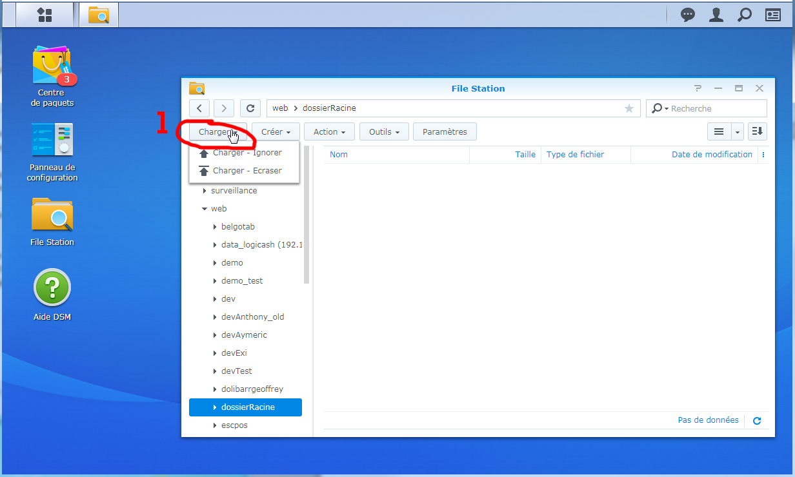
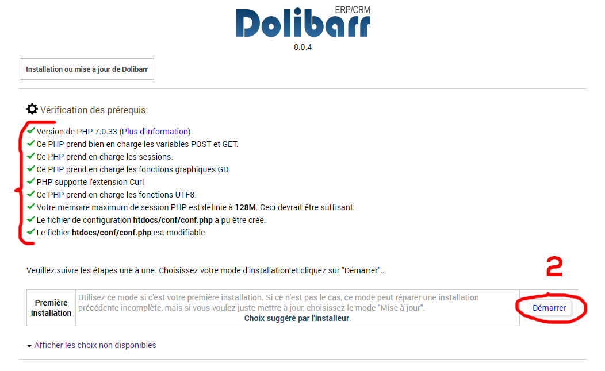
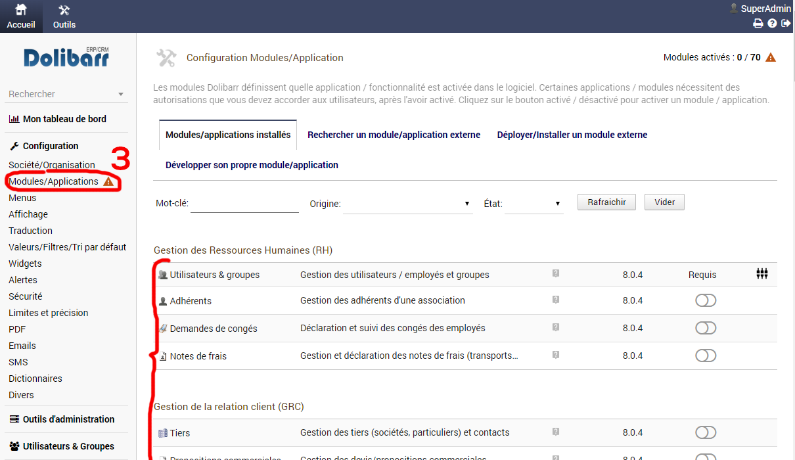

# Installation Dolibarr sur un NAS Synology.

# Chapitres:

 
  
1 : Accéder au serveur 

## Connexion au serveur.

1. Ouvrire un navigateur web.
2. Accéder à l'adresse 192.168.2.45:500
3. Entrer son pass et son login.

 
  
2 : Créer un dossier racine 

## Créer un dossier racine.

1. Cliquer sur **file station**.
2. Sélectionner l'option **web**.
3. Créer un nouveau dossier avec le nom souhaité.

 
  
3 : Créer un virtual host 

## Créer un virtual host.

1. Ouvrire le **menu principal**. 
2. Ouvrire **web sation**.
3. Ouvrire la gestion des **virtual host** dans le menu de gauche.
4. **Créer** un nouvel host.
5. Cocher **basé sur le nom**, entrer un **nom d'hôte** et cocher le **port 80/443**
6. Ajouter le dossier racine **(chapitre 2).**
7. Renseigner le serveur principal **HTTP** et la version de **PHP.**

 
  
4 : Modifier les autorisations du dossier source 

## Modifier les autorisations du dossier source.

1. Retourner dans **file station**.
2. Cliquer droit sur le dossier source et sélectionner les **propriétés**.
3. Cliquer sur **permission**.
4. Selectionner **http**.
5. Cliquer sur **modifier**.
6. Activer les autorisations en lecture et écriture.

 
  
5 : Importer Dolibarr 

## Modifier les autorisations du dossier source.

1. Retourner dans **file station**, ouvrire le dossier source et y importer Dolibarr

 
  
6 : Création et configuration de la base de donnée 

## Instalation de Dolibarr et Création de la base de donnée.

1. accéder à Dolibarr -> **ipDuNas/dossierSource/htdocs**, changer la **langue** et passer à l'étape suivante.
2. si tous les prérequis sont correctes, démarrer l'installation automatique.
3. **Nommer la base de donnée** (pour plus de facilité le même nom que le dossier source).
4. **Sélectionner le serveur** de base de donnée (localhors ou 127.0.0.1).
5. Modifier le **port** avec la valeur **3307**.
6. Cocher **créer la base de donnée** (si elle n'est pas encore créée).
7. Renseigner un **login** et un **mot de passe**.
8. Renseigner de nouveau un **login** et un **mot de passe**.
9. Si les informations sont correctes - lancer la création de la DB (cela peut prendre quelques minutes).
10. Si toutes les informations sont correctes passer a l'étape suiviante et terminer l'installation.

 
  
7 : Configuration de Dolibarr 

## Modifier les autorisations du dossier source.

1. accéder à Dolibarr -> **ipDuNas/dossierSource/htdocs**.
2. dans le menu de gauche cliquer sur **Société/Organisation** pour configurer le comportement par défaut de Dolibarr. (Nom et pays sont obligatoire)
3. Toujours dans le menu de gauche cliquer sur **Modules/Applications** pour activer les modules nécessaires.

